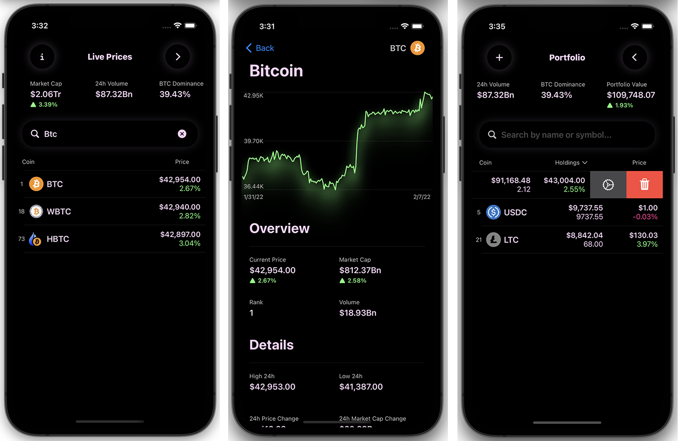

# CryptoApp
This app show cryptocurrencies with help of free CoinGecko API. You can track different coins, 
save them and be on the peak of all crypto news(will be added soon).
This application was completely written in SwiftUI, using Combine framework.  

## Tech Stack

**Client:** SwiftUI, Combine, CoreData

The complete project was made using MVVM architecture. 

Currently runs on iPhone(iOS 15.0+), iPad(iPadOS 15.0+).

